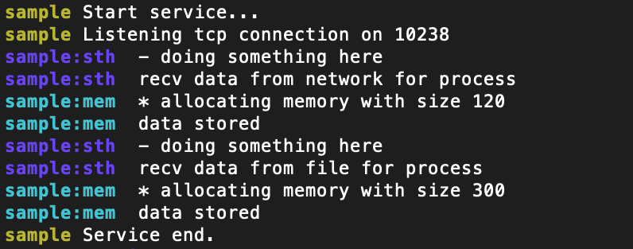

# Simple Debug-Trace Library




A simple Go debugging utility support filtering by namespaces.
Inspired by Node.js [debug](https://github.com/visionmedia/debug) library


## Enabling
- run go program with "-tags debug"
- set env for filtering namespaces for debug logs
```
$ DTRACE=sample,sample:* go run -tags debug sample.go
```

## Using in development

### Sample code
```go
package main

import (
	"net"

	. "github.com/nickeljew/file-relay/debug"
)


var (
	dtrace = NewDTrace("sample")
	sthTrace = NewDTrace("sample:sth")
	memTrace = NewDTrace("sample:mem")
)


func main() {
	dtrace.Log("Start service...")

	netType := "tcp"
	port := "10238"
	lis, err := net.Listen(netType, ":"+port)
	if err == nil {
		dtrace.Logf("Listening %s connection on %s", netType, port)
	}
	defer lis.Close()

	doSth("network")
	handleMem(120)
	doSth("file")
	handleMem(300)

	dtrace.Log("Service end.")
}

func doSth(src string) {
	sthTrace.Log(" - doing something here")
	sthTrace.Logf(" recv data from %s for process", src)
}

func handleMem(sz int) {
	memTrace.Logf(" * allocating memory with size %d", sz)
	memTrace.Log(" data stored")
}
```


### Using namespace to group debug logs
```go
var (
    dtrace = NewDTrace("main")
    ns1aTrace = NewDTrace("ns1:a")
    ns2aTrace = NewDTrace("ns2:a")
    ns2bTrace = NewDTrace("ns2:b")
)
```
Using colon to set namespaces grouped by major names, such as "ns1" and "ns2" in example above

### Filtering namespaces in ENV
```
DTRACE=main,ns1:a,ns2:*,-ns2:b
```

- Using comma as delimiter for multiple namespaces
- Filtering with wildcard schema (e.g. ns1:*) or explicit schema (e.g. ns1:a)
- Specifying namespaces for exclusion (e.g. -ns2:b)
